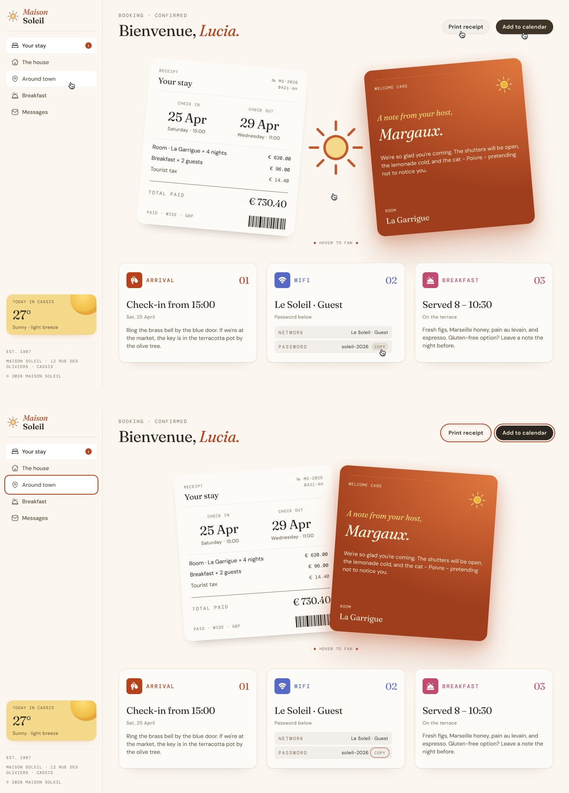
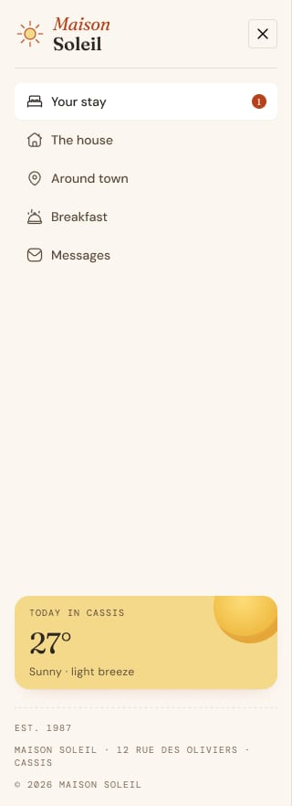

# Frontend Mentor - Solución de la página de confirmación de reserva de hotel

Esta es mi solución al desafío **Hotel Booking Confirmation Page** de Frontend Mentor. Este proyecto se centra en la creación de un dashboard moderno y totalmente responsive para la confirmación de reservas de hotel, que se adapta perfectamente a dispositivos de escritorio, tabletas y móviles.

El desafío fue una excelente oportunidad para practicar la arquitectura de componentes de React, la creación de componentes reutilizables, React Hooks, layouts responsive con Tailwind CSS v4, CSS Grid, Flexbox, estados interactivos de la interfaz, detección de clics fuera de un elemento y el despliegue de una aplicación lista para producción utilizando Vite y GitHub Pages.

---

## Tabla de contenidos

- [Descripción general](#descripción-general)
- [El desafío](#el-desafío)
- [Diseño](#diseño)
- [Enlaces](#enlaces)
- [Mi proceso](#mi-proceso)
- [Tecnologías utilizadas](#tecnologías-utilizadas)
- [Lo que aprendí](#lo-que-aprendí)

---

## Descripción general

Este proyecto es un dashboard responsive de confirmación de reservas de hotel que muestra la información de la estancia del huésped, los detalles de la reserva, los servicios del hotel, información meteorológica y acciones relacionadas con la reserva.

La interfaz fue construida siguiendo un enfoque **mobile-first** utilizando React y Tailwind CSS v4. El layout se adapta a diferentes tamaños de pantalla, desde dispositivos móviles hasta tabletas y ordenadores de escritorio, manteniendo una jerarquía visual y una experiencia de usuario consistentes.

La aplicación está organizada mediante componentes reutilizables de React, lo que facilita el mantenimiento y la ampliación de la interfaz.

---

## El desafío

Los usuarios deben poder:

- Ver el layout óptimo dependiendo del tamaño de pantalla de su dispositivo.
- Visualizar los detalles de confirmación de la reserva del hotel.
- Navegar por las diferentes secciones del dashboard del hotel.
- Abrir y cerrar el menú de navegación móvil.
- Cerrar el menú móvil haciendo clic fuera de él.
- Ver estados interactivos de hover en toda la interfaz.
- Experimentar layouts responsive en dispositivos móviles, tabletas y ordenadores de escritorio.
- Ver diferente información de reserva dependiendo del tipo de reserva.
- Interactuar con los elementos de la interfaz utilizando componentes reutilizables de React.

---

## Diseño

### Diseño de escritorio


### Estados activos



### Diseño móvil


### Navegación móvil



---

## Enlaces

- URL de la solución: [Repositorio de GitHub](https://github.com/mlopezl/hotel-booking-confimation-page)
- URL del sitio en producción: [Demo en vivo](https://mlopezl.github.io/hotel-booking-confimation-page/)

---

## Mi proceso

- Estructuré la aplicación utilizando componentes funcionales reutilizables de React.

- Organicé el proyecto mediante carpetas de componentes basadas en funcionalidades, incluyendo:

  - Navegación
  - Header
  - Tarjetas
  - Reservas

- Seguí un flujo de trabajo mobile-first para garantizar una experiencia responsive en diferentes tamaños de pantalla.

- Construí layouts responsive utilizando Flexbox, CSS Grid y las clases utilitarias de Tailwind CSS.

- Implementé breakpoints responsive utilizando:

  - `md:`
  - `lg:`
  - `xl:`

- Personalicé Tailwind CSS v4 utilizando la directiva `@theme`.

- Creé un sistema de diseño personalizado utilizando variables CSS para:

  - Colores
  - Tipografía

- Configuré fuentes personalizadas de Google Fonts, incluyendo:

  - Fraunces
  - DM Sans
  - DM Mono

- Creé componentes reutilizables para elementos de navegación, tarjetas, contenido de reservas y elementos interactivos.

- Utilicé props de React para pasar datos y funciones callback entre componentes padre e hijo.

- Gestioné el estado de la interfaz utilizando el Hook `useState` de React.

- Implementé renderizado condicional basado en el estado de los componentes y en los valores de los datos.

- Rendericé dinámicamente los elementos de navegación y las tarjetas de reserva utilizando el método `.map()`.

- Utilicé props `key` únicas al renderizar listas dinámicas.

- Implementé composición de componentes utilizando la prop `children`.

- Creé tarjetas de reserva basadas en datos que renderizan contenido diferente dependiendo del tipo de reserva.

- Implementé estados interactivos de hover utilizando el estado de React y eventos del mouse.

- Añadí interacciones de hover utilizando:

  - `onMouseEnter`
  - `onMouseLeave`

- Implementé un menú de navegación móvil responsive utilizando el estado de React.

- Gestioné el estado de la navegación móvil mediante funciones callback reutilizables.

- Añadí detección de clics fuera del componente utilizando:

  - `useEffect`
  - `useRef`
  - `document.addEventListener()`

- Cerré automáticamente la navegación móvil cuando el usuario hace clic fuera del contenedor de navegación.

- Limpié los event listeners globales cuando el componente se desmonta.

- Añadí atributos de accesibilidad a los elementos interactivos, incluyendo:

  - `aria-expanded`
  - `aria-controls`
  - `aria-label`

- Utilicé recursos SVG e imágenes optimizadas en toda la interfaz.

- Construí y optimicé el proyecto utilizando Vite.

- Generé una build de producción con:

```bash
pnpm run build
```

- Desplegué la build de producción en GitHub Pages.

## Tecnologías utilizadas

- React
- JSX
- JavaScript (ES6+)
- React Hooks
- `useState`
- `useEffect`
- `useRef`
- Props de React
- Composición de componentes
- Tailwind CSS v4
- CSS Grid
- Flexbox
- Propiedades personalizadas de CSS (Variables CSS)
- Google Fonts
- Recursos SVG
- Principios de diseño responsive
- Flujo de trabajo Mobile-first
- HTML semántico
- Renderizado condicional
- Renderizado dinámico de listas
- Gestión de eventos
- Eventos del DOM
- Detección de clics fuera de un componente
- Atributos de accesibilidad
- Personalización del tema de Tailwind
- Vite
- PNPM
- ESLint
- GitHub Pages

---

## Lo que aprendí

- Construir interfaces responsive utilizando React y Tailwind CSS.
- Crear componentes reutilizables de React con una clara separación de responsabilidades.
- Pasar datos y funciones callback entre componentes utilizando props.
- Gestionar estados interactivos de la interfaz con el Hook `useState`.
- Utilizar renderizado condicional para cambiar dinámicamente la interfaz según el estado de la aplicación.
- Renderizar contenido dinámico a partir de arrays de JavaScript utilizando el método `.map()`.
- Comprender la importancia de utilizar props `key` únicas al renderizar listas en React.
- Utilizar la composición de componentes y la prop `children` para crear componentes reutilizables y flexibles.
- Construir componentes de interfaz basados en datos, separando el contenido de la lógica de presentación.
- Crear efectos interactivos de hover combinando el estado de React con las clases de Tailwind CSS.
- Trabajar con eventos del mouse de React como `onMouseEnter` y `onMouseLeave`.
- Utilizar `useEffect` para gestionar efectos secundarios y event listeners globales del DOM.
- Utilizar `useRef` para referenciar elementos del DOM desde componentes de React.
- Detectar clics fuera de un componente utilizando `contains()`.
- Limpiar event listeners dentro de la función de limpieza de `useEffect`.
- Crear controles de navegación accesibles utilizando atributos ARIA.
- Trabajar con Tailwind CSS v4 y el sistema de configuración `@theme`.
- Crear tokens de diseño reutilizables mediante propiedades personalizadas de CSS.
- Construir layouts responsive utilizando CSS Grid y Flexbox en conjunto.
- Organizar una aplicación React utilizando una estructura de componentes basada en funcionalidades.
- Comprender el flujo de desarrollo y producción de Vite.
- Crear bundles de producción optimizados con Vite.
- Desplegar una aplicación React en GitHub Pages.
